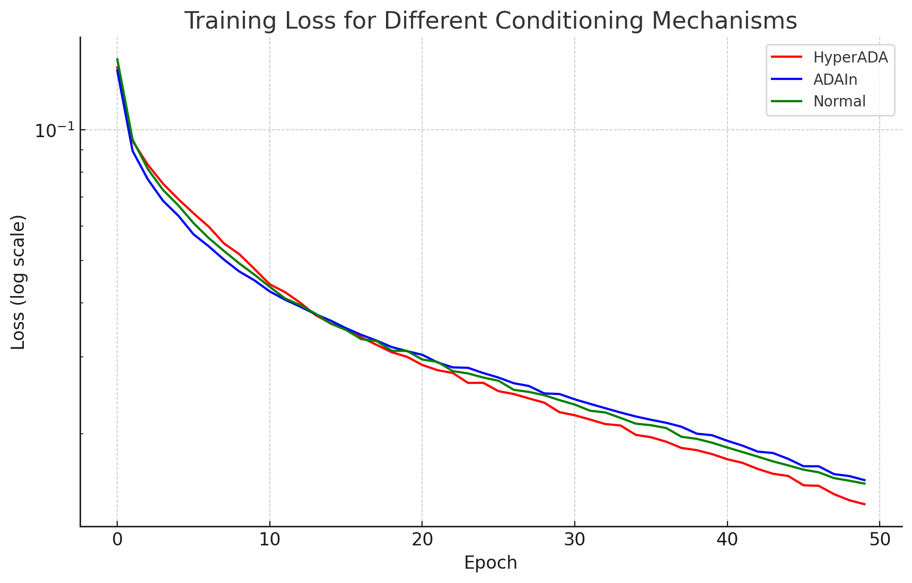

# Conditional DDPM

## NEW: HyperADA

this is is tiny experiment i've been working on, i found that a hypernetwork (linear weights) based ada on a larger conditional diffusion model that was more sensitive to adjustments on conditioners, and less entangled, so took the liberity and implemented it here :D, tested both AdaIN & naive scale shift of (conditioner, time) & the new HyperADA (lower loss)

## Introduction

We implement a simple conditional form of *Diffusion Model* described in [Denoising Diffusion Probabilistic Models](https://arxiv.org/abs/2006.11239), in PyTorch. Preparing this repository, we inspired by the course [How Diffusion Models Work](https://www.deeplearning.ai/short-courses/how-diffusion-models-work) and the repository [minDiffusion](https://github.com/cloneofsimo/minDiffusion). While training, we use [MNIST](http://yann.lecun.com/exdb/mnist/), [FashionMNIST](https://github.com/zalandoresearch/fashion-mnist), and Sprite (see [FrootsnVeggies](https://zrghr.itch.io/froots-and-veggies-culinary-pixels) and [kyrise](https://kyrise.itch.io/)) datasets.

## Setting Up the Environment

1. Install [Conda](https://conda.io/projects/conda/en/latest/user-guide/install/index.html), if not already installed.
2. Clone the repository
    ~~~
    git clone https://github.com/byrkbrk/diffusion-model.git
    ~~~
3. In the directory `diffusion-model`, for macos, run:
    ~~~
    conda env create -f diffusion-env_macos.yaml
    ~~~
    For linux or windows, run:
    ~~~
    conda env create -f diffusion-env_linux_or_windows.yaml
    ~~~
4. Activate the environment:
    ~~~
    conda activate diffusion-env
    ~~~

## Training and Sampling

### MNIST
To train the model on MNIST dataset from scratch,
~~~
python3 train.py --dataset-name mnist
~~~

In order to sample from our (pretrained) checkpoint:
~~~
python3 sample.py pretrained_mnist_checkpoint_49.pth --n-samples 400 --n-images-per-row 20
~~~

Results (jpeg and gif files) will be saved into `generated-images` directory, and are seen below where each two rows represents a class label (in total 20 rows and 10 classes).

  
  

### Fashion-MNIST

To train the model from scratch on Fashion-MNIST dataset,
~~~
python3 train.py --dataset-name fashion_mnist
~~~

In order to sample from our (pretrained) checkpoint, run:
~~~
python3 sample.py pretrained_fashion_mnist_checkpoint_49.pth --n-samples 400 --n-images-per-row 20
~~~

Results (jpeg and gif files) will be saved into `generated-images` directory, and are seen below where each two rows represents a class label (in total 20 rows and 10 classes).

  
  

### Sprite
To train the model from scratch on Sprite dataset:
~~~
python3 train.py --dataset-name sprite
~~~

In order to sample from our (pretrained) checkpoint, run:
~~~
python3 sample.py pretrained_sprite_checkpoint_49.pth --n-samples 225 --n-images-per-row 15
~~~

Results (jpeg and gif files) will be saved into `generated-images` directory, and are seen below where each three rows represents a class label (in total 15 rows and 5 classes).

  
  

